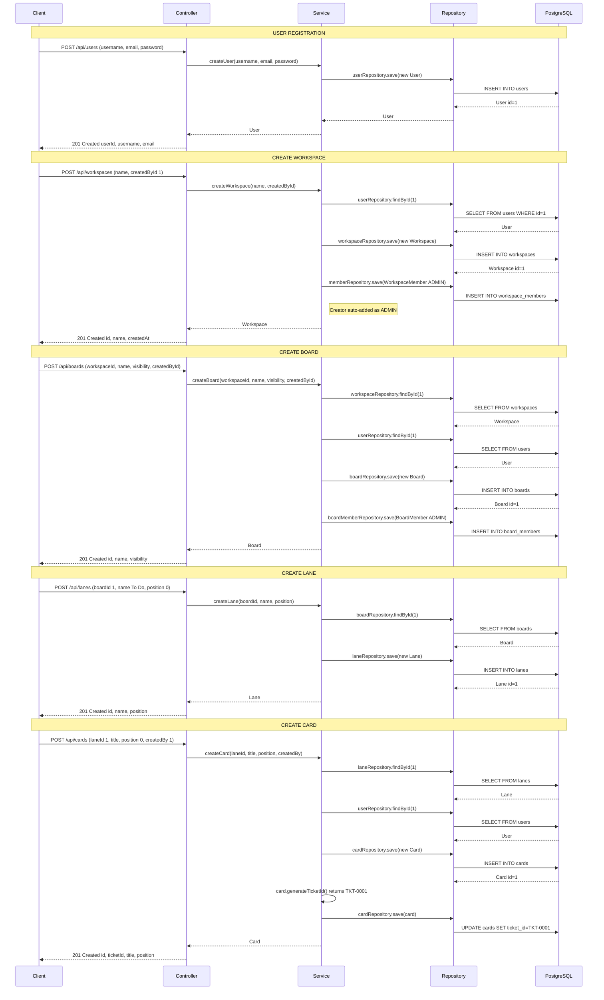
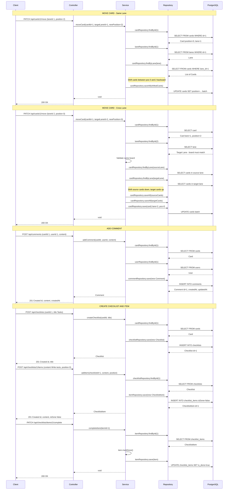
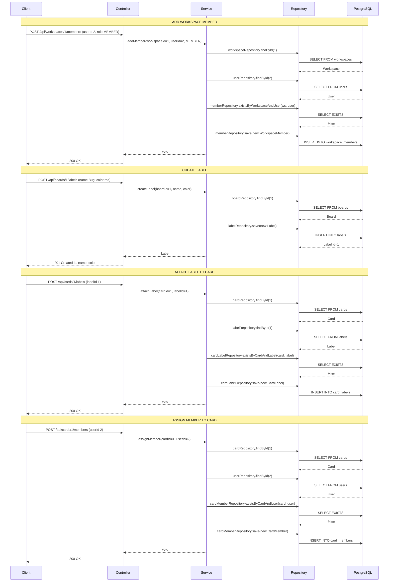
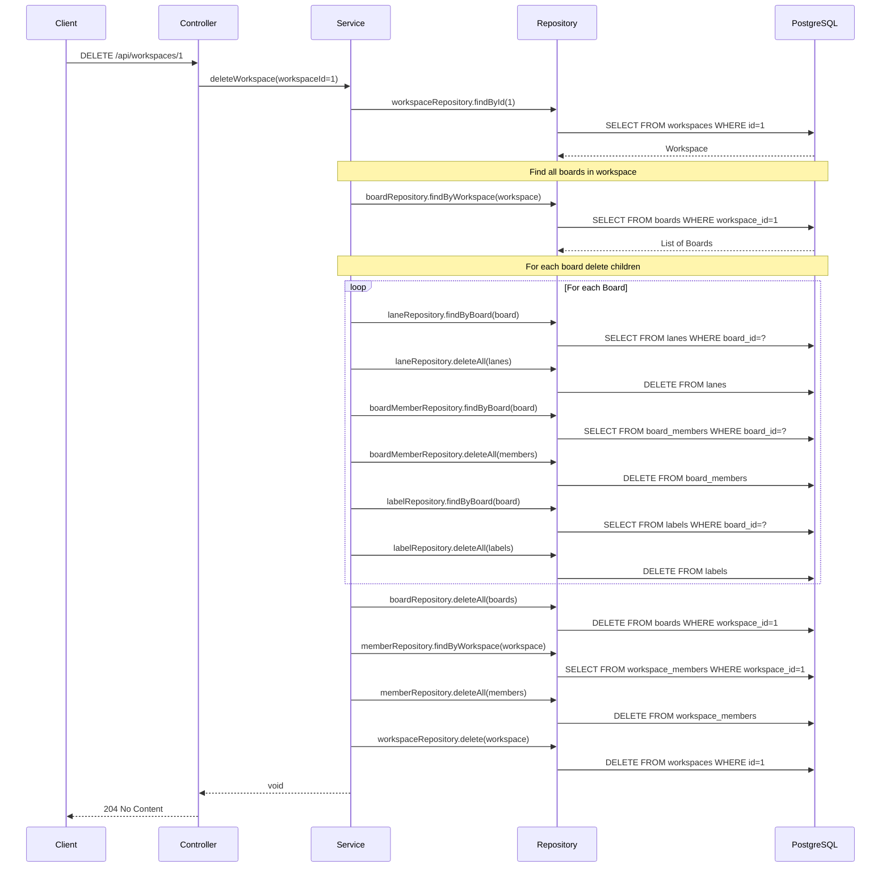
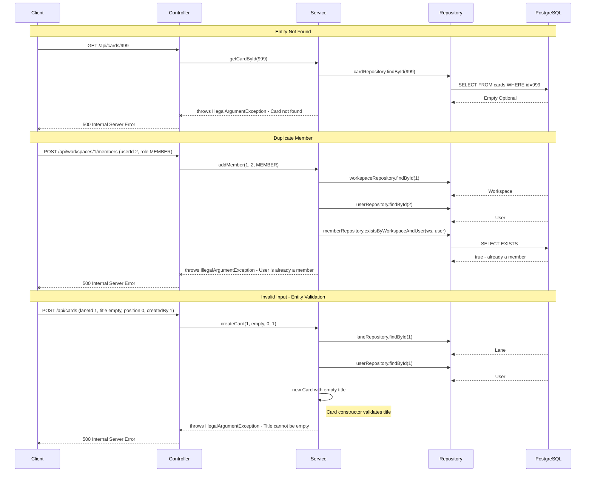
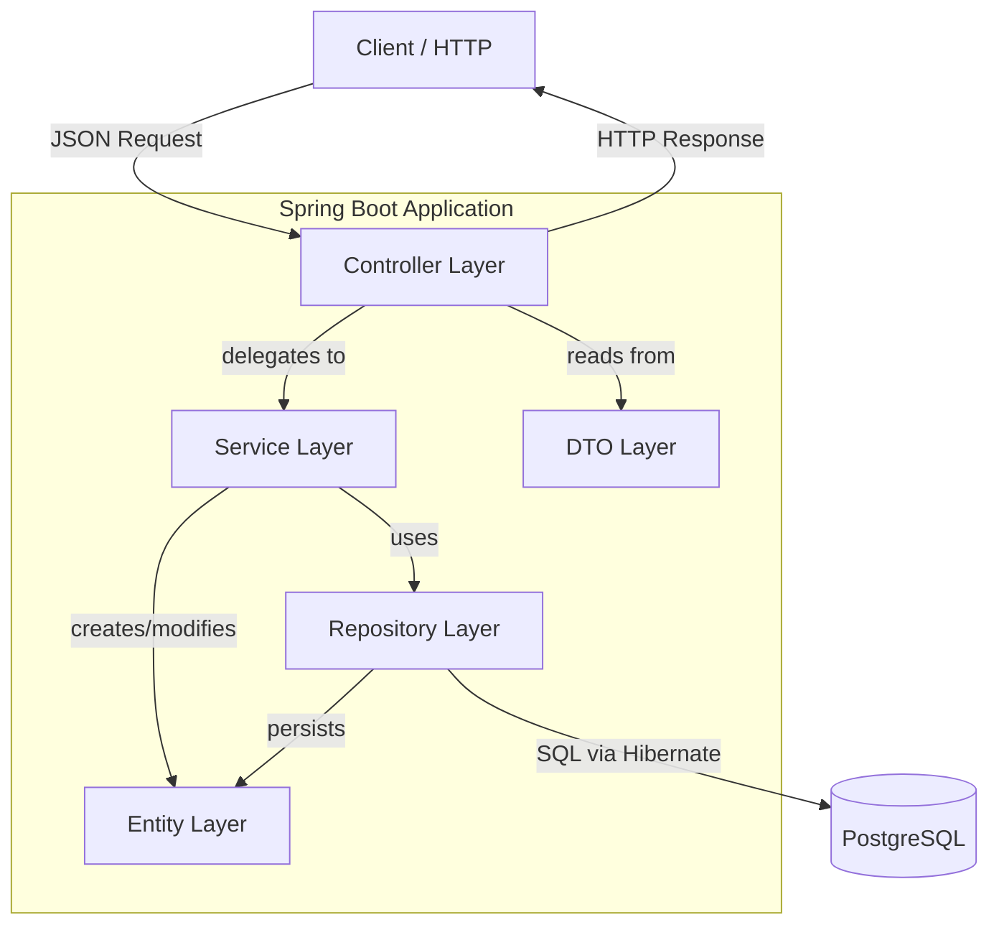

# Myapp - Sequence Diagrams

## 1. Full Workflow: From User Registration to Card Management

This diagram shows the complete happy-path flow of setting up a workspace and managing cards.

## 2. Card Operations: Move, Comment, Checklist

## 3. Membership & Label Management

## 4. Cascade Delete: Workspace Deletion

## 5. Error Flow: Validation Failure

## Architecture Layer Diagram

